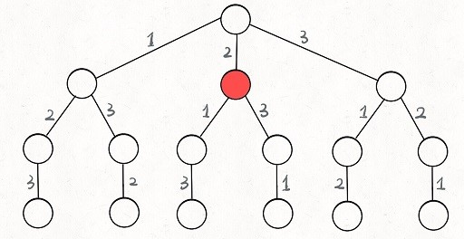
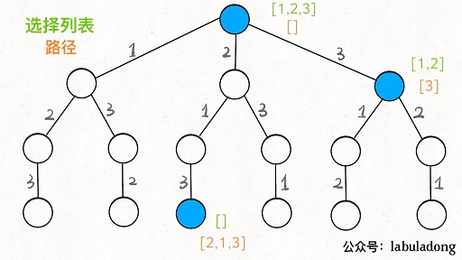

# 回溯法

常说的五大算法思维是指：**回溯法、贪心算法、分治法、动态规划和分支限界算法。**

## ✏ 1、回溯算法框架

**解决一个回溯问题，实际上就是一个决策树的遍历过程**。只需要思考 3 个问题：

1. 路径：也就是已经做出的选择。
2. 选择列表：也就是你当前可以做的选择。
3. 结束条件：也就是到达决策树底层，无法再做选择的条件。

回溯算法的框架：

```python
result = []
def backtrack(路径, 选择列表):
    if 满足结束条件:
        result.add(路径)
        return

    for 选择 in 选择列表:
        做选择
        backtrack(路径, 选择列表)
        撤销选择
```

**其核心就是 for 循环里面的递归，在递归调用之前「做选择」，在递归调用之后「撤销选择」**

### [全排列问题](https://leetcode-cn.com/problems/permutations/)

 给定一个 **没有重复** 数字的序列，返回其所有可能的全排列。

`n` 个不重复的数，全排列共有 $$n!$$ 个。该问题的解空间可以反映在下面的**「决策树」**上，以三个数 `[1,2,3]`为例：



加入此时站在上图的红色节点上做决策：**`[2]` 就是「路径」，记录你已经做过的选择；`[1,3]` 就是「选择列表」，表示你当前可以做出的选择；「结束条件」就是遍历到树的底层，在这里就是选择列表为空的时候**。

**可以把「路径」和「选择」列表作为决策树上每个节点的属性**，比如下图列出了几个节点的属性：



**前面定义的 `backtrack` 函数其实就像一个指针，在这棵树上游走，同时要正确维护每个节点的属性，每当走到树的底层，其「路径」就是一个全排列**。

各种搜索问题本质上都是树的遍历问题，而多叉树的遍历框架（递归）就是这样：

```cpp
void traverse(TreeNode root) {
    for (TreeNode child : root.childern)
        // 前序遍历需要的操作
        traverse(child);
        // 后序遍历需要的操作
}
```

**只要在递归之前做出选择，在递归之后撤销刚才的选择**，就能正确得到每个节点的选择列表和路径。代码如下：

```cpp
void backtrack(std::vector<std::vector<int>> &result, std::vector<int> &track, std::vector<int>& nums){
    if(track.size() == nums.size()){
        result.push_back(track);
        return;
    }
    for(int i : nums){
        if(std::find(track.begin(), track.end(), i) != track.end())
            continue;
        track.push_back(i);
        backtrack(result, track, nums);
        track.pop_back();
    }
}
vector<vector<int>> permute(vector<int>& nums) {
    std::vector<std::vector<int>> result;
    std::vector<int> track;
    backtrack(result, track, nums);
    return result;
}
```

这个算法解决全排列不是很高效，因为对链表使用 `find` 方法需要 `O(N)` 的时间复杂度。

必须说明的是，这道题不管怎么优化，都符合回溯框架，而且时间复杂度都不可能低于 $$O(n!)$$ ，因为穷举整棵决策树是无法避免的。**这也是回溯算法的一个特点，不像动态规划存在重叠子问题可以优化，回溯算法就是纯暴力穷举，复杂度一般都很高**。

## ✏ 2、题型

### \*\*\*\*[**Permutations II**](https://leetcode-cn.com/problems/permutations-ii/)\*\*\*\*

给定一个可包含重复数字的序列，返回所有不重复的全排列。

```cpp

```

### \*\*\*\*[**N-Queens**](https://leetcode-cn.com/problems/n-queens/)\*\*\*\*

 $$n$$ __皇后问题研究的是如何将 $$n$$ 个皇后放置在 $$n\times n$$ 的棋盘上，并且使皇后彼此之间不能相互攻击。


### [copy-list-with-random-pointer](https://leetcode-cn.com/problems/copy-list-with-random-pointer/)


## ✏ 3、回溯法与动态规划

回溯算法就是个多叉树的遍历问题，关键就是在前序遍历和后序遍历的位置做一些操作。**写 `backtrack` 函数时，需要维护走过的「路径」和当前可以做的「选择列表」，当触发「结束条件」时，将「路径」记入结果集**。

回溯算法和动态规划很像，动态规划的三个需要明确的点就是「状态」「选择」和「base case」，对应着回溯算法中的走过的「路径」，当前的「选择列表」和「结束条件」。某种程度上说，动态规划的暴力求解阶段就是回溯算法。只是有的问题具有重叠子问题性质，可以用 `dp table` 或者备忘录优化，将递归树大幅剪枝，这就变成了动态规划。


### 

\*\*\*\*

\*\*\*\*

