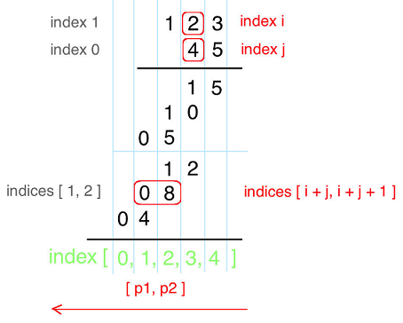

# 分治法

> 分治法即“分而治之”，就是把一个复杂的问题分成两个或更多的相同或相似的子问题，再把子问题分成更小的子问题……直到最后子问题可以简单的直接求解，原问题的解即子问题的解的合并。

## \*\*\*\*✏ **可使用分治法求解的一些经典问题**

* 二分搜索
* 大整数乘法
* Strassen矩阵乘法
* 棋牌覆盖
* [归并排序](../algorithm/sort-algorithm.md#gui-bing-pai-xu-er-lu-gui-bing)和[快速排序](../algorithm/sort-algorithm.md#kuai-su-pai-xu)
* 线性时间选择
* 最接近点对问题
* 循环赛日程表
* 汉诺塔

## ✏ 算法实现

### 🖌 1、[二叉树DFS深度搜索——自下而上](https://leetcode-cn.com/problems/binary-tree-preorder-traversal/)

```cpp
vector<int> preorderTraversal(TreeNode* root) {
    vector<int> result;
    // 返回条件(NULL)
    if(!root)
        return result;
    // 分治(Divide)
    vector<int> result_left, result_right;
    if(root->left){
        result_left = preorderTraversal(root->left);
    } 
    if(root->right){
        result_right = preorderTraversal(root->right);
    } 
    // 合并结果(Conquer)
    result.push_back(root->val);
    result.insert(result.end(), result_left.begin(), result_left.end());
    result.insert(result.end(), result_right.begin(), result_right.end());
    return result;
}  
```

### 🖌 2、[大整数相乘](https://leetcode-cn.com/problems/multiply-strings/)

两个 $$n$$ 位的大整数相乘，按照基线乘法（也就是笔算乘法或竖式计算法），算法的时间复杂度是 $$O(n^2)$$ ，基线乘法在 $$O(n^2)$$ 的复杂度上进行计算和向上传递进位，每计算一次单精度乘法都要计算和传递进位，这样的话就使得嵌套循环的顺序性很强，难以并行展开和实现。有一种改进的 Comba 乘法，和普通的笔算乘法很类似，只是每一次单精度乘法只是单纯计算乘法，不计算进位，进位留到每一列累加后进行。所以原来需要 $$n^2$$ 次进位，现在最多只需要 $$2n$$ 次即可。

然而这个问题可以用分治法来解决，时间复杂度可降至 $$O(n^{1.59})$$ ，即**Karatsuba算法**。


算法：首先将 X 和 Y 分成A、B、C、D，此时将 X 和 Y 的乘积转化为图中的式子，把问题转化为求解式子的值。对于这个式子，我们一共要进行4 次乘法（AC、AD、BC、BD），所以 $$a = 4$$ ，建立递归方程：

$$
T(n) = 4 \times T(n / 2) + \theta(n)
$$

通过master定理可以求得该算法的时间复杂度为： $$T(n) = \theta(n ^ 2)$$ 。然后用加法来换取乘法：

$$
\begin{aligned}
XY & = (A\times 2^{\frac{n}{2}} + B)(C\times 2^{\frac{n}{2}} + D) \\
& = AC\times 2^n + ((A+B)(C+D)-AC-BD)\times 2^{\frac{n}{2}} + BD
\end{aligned}
$$

对于这个公式，一共进行了三次乘法（AC、BD、\(A+B\)\(C+D\)），因此， $$a = 3$$ ，建立递归方程：

$$
T(n) = 3 \times T(n / 2) + \theta(n)
$$

通过master定理求得时间复杂度为： $$T(n) = O(n^{log_2 3 }) = O(n^{1.59})$$ 。

另外常见的大数相乘算法还有 [**快速傅里叶变换算法**](https://en.wikipedia.org/wiki/Fast_Fourier_transform)**（** **fast Fourier transform** \(**FFT**\)**）。**

**这道题除了按普通的竖式求解（**即遍历 `num2` 每一位与 `num1` 进行相乘，将每一步的结果进行累加）外，还可以**可以通过优化竖式来求解，两种优化方法：**

> 一、通过两数相乘时，乘数某位与被乘数某位相乘，与产生结果的位置的规律来完成。
>
> 具体规律如下：
>
> * 乘数 `num1` 位数为 $$M$$ ，被乘数 `num2` 位数为 $$N$$ ， `num1 x num2` 结果 `res` 最大总位数为 $$M+N$$ 。
> * `num1[i] x num2[j]` 的结果为 `tmp`\(位数为两位，`"0x","xy"`的形式\)，其第一位位于 `res[i+j]`，第二位位于 `res[i+j+1]`。



> 二、模拟乘法，将所有数据不单独进位（可直接存入数组），最后统一进位。（实现）


```cpp
string multiply(string num1, string num2) {
    if(num1[0] == '0' || num2[0] == '0'){
        return "0";
    }
    string result;
    int carry = 0, sum = 0;
    int len1 = num1.size();
    int len2 = num2.size();
    for(int i = len2 - 1;i >= 0;i--){
        sum = 0;
        for(int j = len1 - 1;j >= 0 && i + (len1 - 1 - j) < len2;j--){
            sum += (num1[j] - '0') * (num2[i + (len1 - 1 - j)] - '0');
        }
        sum += carry;
        carry = sum / 10;
        result.insert(0, 1, char(sum % 10 + '0'));
    }
    for(int i = len1 - 2;i >= 0;i--){
        sum = 0;
        for(int j = 0;j < len2 && i - j >= 0;j++){
            sum += (num2[j] - '0') * (num1[i - j] - '0');
        }
        sum += carry;
        carry = sum / 10;
        result.insert(0, 1, char(sum % 10 + '0'));
    }
    while(carry > 0){
        result.insert(0, 1, char(carry % 10 + '0'));
        carry = carry / 10;
    }
    return result;
}
```

### 🖌 3、[**最大子序和**](https://leetcode-cn.com/problems/maximum-subarray/)\*\*\*\*

给定一个整数数组 `nums` ，找到一个具有最大和的连续子数组（子数组最少包含一个元素），返回其最大和。

> #### 方法一：Kadane算法 <a id="%E6%96%B9%E6%B3%95%E4%B8%80%EF%BC%9AKadane%E7%AE%97%E6%B3%95"></a>

> 1. 遍历该数组， 在遍历过程中， 将遍历到的元素依次累加起来， 当累加结果小于或等于 0 ****时， 从下一个元素开始，重新开始累加。
> 2. 累加过程中， 要用一个变量 result 记录所获得过的最大值。
> 3. 一次遍历之后， 变量 result 中存储的即为最大子片段的和值。

```cpp
int maxSubArray(vector<int>& nums) {
    int result = nums[0]; // 要求子数组最少包含一个元素，
                          // 当数组中都为负数和0时，需要返回最大的一个值
    int current = 0;
    for(int i = 0;i < nums.size();i++){
        current += nums[i];
        if(current > result){
            result = current;
        }
        if(current < 0){
            current = 0;
        }
    }
    return result;
}
```

理解此算法的关键在于:

1. 最大子片段中不可能包含求和值为负的前缀。 例如 【-2， 1，4】 必然不能是最大子数列， 因为去掉值为负的前缀后【-2，1】， 可以得到一个更大的子数列 【4】、
2. 所以在遍历过程中，每当累加结果成为一个非正值时， 就应当将下一个元素作为潜在最大子数列的起始元素， 重新开始累加。
3. 由于在累加过程中， 出现过的最大值都会被记录， 且每一个可能成为 最大子数列起始元素 的位置， 都会导致新一轮的累加， 这样就保证了答案搜索过程的完备性和正确性。

> **方法二：动态规划**

### \*\*\*\*🖌 **4、**[**寻找两个正序数组的中位数**](https://leetcode-cn.com/problems/median-of-two-sorted-arrays/)\*\*\*\*

给定两个大小为 m 和 n 的正序（从小到大）数组 nums1 和 nums2。找出这两个正序数组的中位数，并且要求算法的时间复杂度为 $$O(log(m + n))$$ ****。假设 nums1 和 nums2 不会同时为空。

> 方法一：走一趟遍历，边界情况很多，复杂度满足要求，但是代码很乱。

```cpp
double findMedianSortedArrays(vector<int>& nums1, vector<int>& nums2) {
    int len1 = nums1.size();
    int len2 = nums2.size();
    // 有一个数组为空的情况
    if(len1 == 0){
        return len2 % 2 == 1 ? nums2[len2 / 2] : (nums2[len2 / 2] + nums2[len2 / 2 - 1]) / 2.0;
    }
    if(len2 == 0){
        return len1 % 2 == 1 ? nums1[len1 / 2] : (nums1[len1 / 2] + nums1[len1 / 2 - 1]) / 2.0;
    }
    int count = (len1 + len2) / 2 - 1;
    int i = 0, j = 0;
    // 不管奇数还是偶数，都先保留两个数，最后统一做判断
    int num1, num2;
    // 跳过前count个数
    while(i < len1 && j < len2 && count > 0){
        if(nums1[i] < nums2[j])
            i++;
        else
            j++;
        count--;
    }
    // 接下来的连续两个数就是需要的
    if(count == 0){
        if(i >= len1){ // 两个数都在同一个数组
            num1 = nums2[j];
            num2 = nums2[j + 1];
        }else if(j >= len2){
            num1 = nums1[i];
            num2 = nums1[i + 1];
        }else if(j + 1 >= len2 && i + 1 >= len1){ // 两个数组都只有一个数字
            num1 = nums1[i];
            num2 = nums2[j];
        }else if(j + 1 >= len2){ // 一个数组有一个数字，另一个多于一个数字，所以三个中取两个小的
            num1 = min(nums1[i], nums1[i + 1]);
            num2 = min(max(nums1[i], nums1[i + 1]), nums2[j]);
        }else if(i + 1 >= len1){
            num1 = min(nums2[j], nums2[j + 1]);
            num2 = min(max(nums2[j], nums2[j + 1]), nums1[i]);
        }else{ // 两个数组都多于一个数字，所以四个中取两个小的
            if(nums1[i] < nums2[j]){
                num1 = nums1[i];
                i++;
            }else{
                num1 = nums2[j];
                j++;
            }
            if(nums1[i] < nums2[j]){
                num2 = nums1[i];
                i++;
            }else{
                num2 = nums2[j];
                j++;
            }
        }
    }else{  // 还没跳过count个数，其中一个数组就走完了
        if(i < len1){
            num1 = nums1[i + count];
            num2 = nums1[i + count + 1];
        }else{
            num1 = nums2[j + count];
            num2 = nums2[j + count + 1];
        }
    }
    // 统一判断奇数和偶数的情况
    double result = 0;
    if((len1 + len2) % 2 == 0){
        result = (num1 + num2) / 2.0;
    }else{
        result = max(num1, num2);
    }
    return result;
}
```

