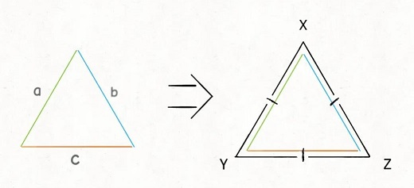

# 几何问题

## ✏ 1、利用几何性质解决问题

### [吃葡萄](https://www.nowcoder.com/questionTerminal/14c0359fb77a48319f0122ec175c9ada)

有三种葡萄，每种分别有a、b、c颗。有三个人，第一个人只吃第1、2种葡萄，第二个人只吃第2、3种葡萄，第三个人只吃第1、3种葡萄。适当安排三个人使得吃完所有的葡萄，并且且三个人中吃的最多的那个人吃得尽量少。

**输入描述:**

* 第一行数字 ****$$\mathit T$$ ，表示数据组数。
* 接下来 $$\mathit  T$$ 行，每行三个数 $$\mathit a,b,c$$ 
* $$1 \leq a,b,c \leq 10^{18} , 1 \leq T \leq 10$$ 

**输出描述:**

对于每组数据，输出一行一个数字表示三个人中吃的最多的那个人吃的数量。

> **先不管每个人只能吃两种特定葡萄的约束**，你怎么让「吃得最多的那个人吃得最少」？显然，只要平均分就行了，每个人吃`(a+b+c)/3`颗葡萄。即便不能整除，比如说`a+b+c=8`，那也要尽可能平均分，就是说一个人吃 2 颗，另两个人吃 3 颗。

> 综上，「吃得最多的那个人吃得最少」就是让我们尽可能地平均分配，**而吃的最多的那个人吃掉的葡萄颗数就是`(a+b+c)/3`向上取整的结果，也就是`(a+b+c+2)/3`**。
>
> PS：向上取整是一个常用的算法技巧。大部分编程语言中，如果你想计算`M`除以`N`，`M / N`会向下取整，你想向上取整的话，可以改成`(M+(N-1)) / N`。
>
> 现在考虑一下如果加上「每个人只能吃特定两种葡萄」的限制，怎么做？也就是说，每个人只能吃特定两种葡萄，你也要**尽可能**给三个人平均分配，这样才能使得吃得最多的那个人吃得最少。

> 这可复杂了，如果用`X, Y, Z`表示这三个人，就会发现他们组成一个三角关系：


> 如果把葡萄的颗数`a, b, c`作为三条线段，它们的大小作为线段的长度，想一想它们可能组成什么几何图形？我们的目的是否可以转化成「尽可能平分这个几何图形的周长」？
>
> 三条线段组成的图形，那不就是三角形嘛？不急，我们小学就学过，**三角形是要满足两边之和大于第三边的**，假设`a < b < c`，那么有下面两种情况：
>
> **如果`a + b > c`**，那么可以构成一个三角形，只要取每条边的中点，就一定可以把这个三角形的周长平分成三份，且每一份都包含两条边：



> 也就是说，这种情况下，三个人依然是可以平均分配所有葡萄的，吃的最多的人最少可以吃到的葡萄颗数依然是`(a+b+c+2)/3`。
>
> **如果`a + b <= c`**，这三条边就不能组成一个封闭的图形了，那么我们可以将最长边`c`「折断」，也就是形成一个四边形。
>
> 这里面有两种情况：


> 对于情况一，`a + b`和`c`的差距还不大的时候，可以看到依然能够让三个人平分这个四边形，那么吃的最多的人最少可以吃到的葡萄颗数依然是`(a+b+c+2)/3`。
>
> 随着`c`的不断增大，就会出现情况二，此时`c > 2*(a+b)`，由于每个人口味的限制，`X`顶多吃完`a`和`b`，为了尽可能平分，`c`边需要被`Y`或`Z`平分，也就是说此时吃的最多的人最少可以吃到的葡萄颗数就是`(c+1)/2`，即平分`c`边向上取整。

```cpp
int main()
{
    int T = 0;
    long long a = 0, b = 0, c = 0;
    cin >> T;
    while(T > 0){
        cin >> a >> b >> c;
        long long temp = 0;
        if(a>b) temp = a, a = b, b = temp;
        if(b>c) temp = b, b = c, c = temp;
        if(a>b) temp = a, a = b, b = temp;
        if(c > 2 * (a + b)){
            cout << (c + 1) / 2 << endl;
        }else{
            cout << (a + b + c + 2) / 3 << endl;
        }
        --T;
    }
    return 0;
}
```

## ✏ 2、解决几何问题

### \*\*\*\*[**Max Points on a Line**](https://leetcode-cn.com/problems/max-points-on-a-line/)\*\*\*\*

 给定一个二维平面，平面上有 _n_ 个点，求最多有多少个点在同一条直线上。

### [**Largest Rectangle in Histogram**](https://leetcode-cn.com/problems/largest-rectangle-in-histogram/)\*\*\*\*

### \*\*\*\*[**Maximal Rectangle**](https://leetcode-cn.com/problems/maximal-rectangle/)\*\*\*\*

### [接雨水系列](../leetcode-xi-lie/trapping-rain-water.md)


### \*\*\*\*

