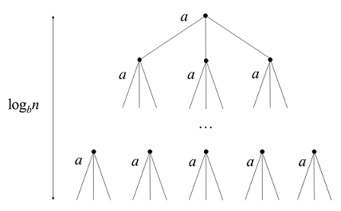

# 附加——主定理

## 主定理

主定理（Master Theorem\)提供了用于分析一类有递归结构算法时间复杂度的方法。我们可以用一种表示方式来概括这些结构的算法：对于一个规模为 $$n$$ 的问题，我们把它分为 $$a$$ 个子问题，每个子问题规模为 $$\frac{n}{b}$$ 。那么这种方法的复杂度 $$T(n)$$ 可以表示为：

$$
T(n)=a\,T\Big(\frac nb\Big)+f(n)
$$

其中 $$a≥1,b>1$$ 为常数， $$\frac{n}{b}$$ 指 $$\lfloor \frac{n}{b}\rfloor$$ 或 $$\lceil \frac{n}{b}\rceil$$ ， $$f(n)$$ 为创造这些递归或者将这些子问题结果整合的函数。对这个方法我们可以建一个递归树：

其中树高为 $$ log_bn$$，树的第 $$i$$ 层有 $$a^i$$ 个节点，每个节点的问题规模为 $$\frac{n}{b^i}$$ 。则这棵树有 $$a^{\log_bn}=n^{\log_ba}$$ 个叶子节点。因此这种方法的复杂度也可以表示为：

$$
T(n)=\Theta(n^{\log_ba})+\sum_{i=0}^{\log_bn-1}a^if\Big(\frac{n}{b^i}\Big)
$$

从中我们可以看出，整个方法的复杂度取决于$$f(n)$$ 的复杂度。主定理对$$f(n)$$ 分了三种情况：

1. $$\exists \varepsilon \gt 0\ s.t.\ f(n)=O(n^{\log_ba-\varepsilon})$$ 。此时， $$T(n)=\Theta(n^{\log_ba})$$ 。
2. $$f(n)=\Theta(n^{\log_ba})$$ 。此时， $$T(n)=\Theta(n^{\log_ba}\lg n)$$ 。
3. $$\exists \varepsilon \gt 0\ s.t.\ f(n)=\Omega(n^{\log_ba+\varepsilon})$$ 且 $$\exists c\lt 1$$ ，当n足够大时，有 $$a\, f(\frac{n}{b})\le c\, f(n)$$ 。此时， $$T(n)=\Theta(f(n))$$ 。

## **证明**

**Case 1**

令 $$g(n)=\sum_{i=0}^{\log_bn-1}a^if(\frac{n}{b^i})$$ ，由 $$f(n)=O(n^{\log_ba-\varepsilon})$$ 得：

$$
g(n)=O\Big(\sum_{i=0}^{\log_bn-1}a^i\Big(\frac{n}{b^i}\Big)^{\log_ba-\varepsilon}\Big)
$$

之后就是对后面式子的化简：

$$
\begin{aligned}
\sum_{i=0}^{\log_bn-1}a^i\Big(\frac{n}{b^i}\Big)^{\log_ba-\varepsilon} & = n^{\log_ba-\varepsilon}\sum_{i=0}^{\log_bn-1}\Big(\frac{ab^\varepsilon}{b^{\log_ba}}\Big)^i\\
    & = n^{\log_ba-\varepsilon}\sum_{i=0}^{\log_bn-1}(b^\varepsilon)^i\\
    & = n^{\log_ba-\varepsilon}\Big(\frac{(b^\varepsilon)^{\log_bn}-1}{b^\varepsilon-1}\Big)^i\\
    & = n^{\log_ba-\varepsilon}\Big(\frac{n^\varepsilon-1}{b^\varepsilon-1}\Big)^i
\end{aligned}
$$

因此 $$g(n)=O(\sum_{i=0}^{\log_bn-1}a^i(\frac{n}{b^i})^{\log_ba-\varepsilon})=O(n^{\log_ba})$$ ，所以有：

$$
T(n)=\Theta(n^{\log_ba})+O(n^{\log_ba})=\Theta(n^{\log_ba})
$$

**Case 2**

同 Case 1。令 $$g(n)=\sum_{i=0}^{\log_bn-1}a^if(\frac{n}{b^i})$$ 得：

$$
g(n)=\Theta\Big(\sum_{i=0}^{\log_bn-1}a^i\Big(\frac{n}{b^i}\Big)^{\log_ba}\Big)
$$

继续化简：

$$
\begin{aligned}
\sum_{i=0}^{\log_bn-1}a^i\Big(\frac{n}{b^i}\Big)^{\log_ba} & = n^{\log_ba}\sum_{i=0}^{\log_bn-1}\Big(\frac{a}{b^{\log_ba}}\Big)^i\\
& = n^{\log_ba}\log_bn
\end{aligned}
$$

因此可得 $$g(n)=n^{\log_ba}\log_bn=n^{\log_ba}\lg n$$ ，所以有：

$$
T(n)= \Theta(n^{\log_ba})+\Theta(n^{\log_ba}\lg n)=\Theta(n^{\log_ba}\lg n)
$$

**Case 3**

令 $$g(n)=\sum_{i=0}^{\log_bn-1}a^if(\frac{n}{b^i})$$ ，但Case 3这里有一个条件： $$a\, f(\frac{n}{b})\le c\, f(n)$$ ，我们对这个条件做一下处理：

$$
\begin{aligned}
    a\, f\Big(\frac{n}{b}\Big) & \le c\, f(n)\\
    \Rightarrow f\Big(\frac{n}{b}\Big) & \le \frac{c}{a}f(n)\\
    \Rightarrow f\Big(\frac{n}{b^2}\Big) & \le \frac{c}{a}f\Big(\frac nb\Big)\le\Big(\frac{c}{a}\Big)^2f(n)\\
    & \vdots\\
    f\Big(\frac{n}{b^i}\Big) & \le\Big(\frac{c}{a}\Big)^if(n)\\
    \Rightarrow a^i\, f\Big(\frac{n}{b^i}\Big) & \le c^i\, f(n)\\
\end{aligned}
$$

由此我们可以很轻易的向下化简：

$$
\begin{aligned}
    \sum_{i=0}^{\log_bn-1}a^i\Big(\frac{n}{b^i}\Big)^{\log_ba} & \le \sum_{i=0}^{\log_bn-1}c^i\,f(n)+O(1)\\
    & \le f(n)\sum_{i=0}c^i+O(1)\\
    & =f(n)\Big(\frac{1}{1-c}\Big)+O(1)\\
    & =f(n)
\end{aligned}
$$

得 $$g(n)=O(f(n))$$ 。又因为 $$g(n)=\sum_{i=0}^{\log_bn-1}a^if(\frac{n}{b^i})\ge f(n)$$ ，得 $$g(n)=\Omega(f(n))$$ 。因此： $$g(n)=\Theta(f(n))$$ ，所以有：

$$
T(n)=\Theta(n^{\log_ba})+\Theta(f(n))=\Theta(f(n))
$$

证毕。

## 应用

### 二叉树建树

$$
T(n)=2T\Big(\frac{n}{2}\Big)+O(1),\ T(n)=O(n)
$$

此时 $$\log_ba\lt 1$$ ，满足Case 1。

### BFPRT\(Median of Medians\)

$$
T(n)\le T\Big(\frac{n}{5}\Big)+\Big(\frac{7n}{10}\Big)+O(n),\ T(n)=O(n)
$$

此时 $$\log_ba\gt 1$$ ，即划分之后总规模减小 $$1/5+7/10\lt 1$$ ，满足Case 2。

### 归并排序

$$
T(n)=2T\Big(\frac{n}{2}\Big)+O(n),\ T(n)=O(\lg n)
$$

此时 $$\log_ba=1$$ ，满足Case 3。

