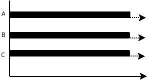

# 并发与多线程

## \*\*\*\*✏ **并发（`concurrency`）和并行（`parallellism`）：**

解释一：并行是指两个或者多个事件在同一时刻发生；而并发是指两个或多个事件在同一时间间隔发生。

解释二：并行是在不同实体上的多个事件，并发是在同一实体上的多个事件。

解释三：并行是在多台处理器上同时处理多个任务。如 `hadoop` 分布式集群，并发是在一台处理器上“同时”处理多个任务。

并行\(parallel\)：指在同一时刻，有多条指令在多个处理器上同时执行。所以无论从微观还是从宏观来看，二者都是一起执行的。

并发\(concurrency\)：指在同一时刻只能有一条指令执行，但多个进程指令被快速的轮换执行，使得在宏观上具有多个进程同时执行的效果，但在微观上并不是同时执行的，只是把时间分成若干段，使多个进程快速交替的执行。

在单核时代，多个线程是**并发**的，在一个时间段内轮流执行；在多核时代，多个线程可以实现真正的**并行**，在多核上真正独立的并行执行。例如现在常见的**4核4线程**可以并行4个线程；**4核8线程**则使用了超线程技术，把一个物理核模拟为2个逻辑核心，可以并行8个线程。并行和串行是对应的概念，并发是一种现象，是并行的假象。

## ✏ 

