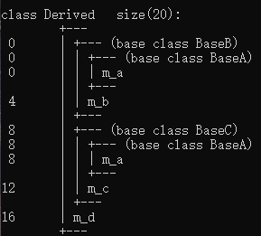
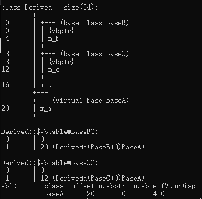

# 面向对象之继承

## ✏ 1、继承方式

公有继承的模式下：

* 基类中的公有成员，在派生类中仍然为公有成员。当然无论派生里的成员函数还是派生类对象都可以访问。
* 基类中的私有成员，无论在派生类的成员还是派生类对象都不可以访问。
* 基类中的保护成员，在派生类中仍然是保护类型，可以通过派生类的成员函数访问，但派生类对象不可以访问。

私有继承的模式下：

* 基类的公有和受保护类型，被派生类私有继承吸收后，都变为派生类的私有类型，即在类的成员函数里可以访问，不能在类外访问。
* 而基类的私有成员，在派生类无论类内还是类外都不可以访问。

保护继承的模式下：

* 基类的公有成员和保护类型成员在派生类中为保护成员。
* 基类的私有成员，在派生类无论类内还是类外都不可以访问。


> **public继承**：是一个接口继承，保持`is-a`原则，每个父类可用的成员对子类也可用，因为每个子类对象也都是一个父类对象。
>
> **protected/private继承**：是一个实现继承，基类的部分成员并非完全成为子类接口的一部分，是 `has-a`的关系原则，所以非特殊情况下不会使用这两种继承关系，在绝大多数的场景下使用的都是公有继承。私有继承通常组合更低级，但当一个派生类需要访问基类保护成员或需要重定义基类的虚函数时它就是合理的。

## ✏ 2、继承关系

### 🖋 2.1、多重继承

多重继承：一个基类有一个派生类，这个派生类又有一个派生类。

#### 💎 ****多重继承下的构造函数

按照继承的顺序调用构造函数。

```cpp
//基类
class BaseA {
public:
    BaseA(int a, int b);
    ~BaseA();
protected:
    int m_a;
    int m_b;
};
BaseA::BaseA(int a, int b) : m_a(a), m_b(b) {
    cout << "BaseA constructor" << endl;
}
BaseA::~BaseA() {
    cout << "BaseA destructor" << endl;
}

//基类
class BaseB : public BaseA {
public:
    BaseB(int a, int b, int c, int d);
    ~BaseB();
protected:
    int m_c;
    int m_d;
};
BaseB::BaseB(int a, int b, int c, int d) : BaseA(a, b), m_c(c), m_d(d) {
    cout << "BaseB constructor" << endl;
}
BaseB::~BaseB() {
    cout << "BaseB destructor" << endl;
}

//派生类
class Derived : public BaseB {
public:
    Derived(int a, int b, int c, int d, int e);
    ~Derived();
public:
    void show();
private:
    int m_e;
};
Derived::Derived(int a, int b, int c, int d, int e) : BaseB(a, b, c, d), m_e(e) {
    cout << "Derived constructor" << endl;
}
Derived::~Derived() {
    cout << "Derived destructor" << endl;
}
void Derived::show() {
    cout << m_a << ", " << m_b << ", " << m_c << ", " << m_d << ", " << m_e << endl;
}

int main() {
    Derived obj(1, 2, 3, 4, 5);
    obj.show();
    return 0;
}

// 输出
BaseA constructor
BaseB constructor
Derived constructor
1, 2, 3, 4, 5
Derived destructor
BaseB destructor
BaseA destructor
```

### 🖋 2.2、多继承

多继承的语法很简单，将多个基类用逗号隔开即可：

```cpp
class D: public A, private B, protected C{
    //类D新增加的成员
}
```

#### 💎 ****多继承下的构造函数

多继承形式下的构造函数和单继承形式基本相同，只是要在派生类的构造函数中调用多个基类的构造函数。以上面的 A、B、C、D 类为例，D 类构造函数的写法为：

```cpp
D(形参列表): A(实参列表), B(实参列表), C(实参列表){
    //其他操作
}
```

**基类构造函数的调用顺序和它们在派生类构造函数中出现的顺序无关，而是和声明派生类时基类出现的顺序相同。**

```cpp
//基类
class BaseA {
public:
    BaseA(int a, int b);
    ~BaseA();
protected:
    int m_a;
    int m_b;
};
BaseA::BaseA(int a, int b) : m_a(a), m_b(b) {
    cout << "BaseA constructor" << endl;
}
BaseA::~BaseA() {
    cout << "BaseA destructor" << endl;
}

//基类
class BaseB {
public:
    BaseB(int c, int d);
    ~BaseB();
protected:
    int m_c;
    int m_d;
};
BaseB::BaseB(int c, int d) : m_c(c), m_d(d) {
    cout << "BaseB constructor" << endl;
}
BaseB::~BaseB() {
    cout << "BaseB destructor" << endl;
}

//派生类
class Derived : public BaseA, public BaseB {
public:
    Derived(int a, int b, int c, int d, int e);
    ~Derived();
public:
    void show();
private:
    int m_e;
};
Derived::Derived(int a, int b, int c, int d, int e) : BaseB(a, b), BaseA(c, d), m_e(e) {
    cout << "Derived constructor" << endl;
}
Derived::~Derived() {
    cout << "Derived destructor" << endl;
}
void Derived::show() {
    cout << m_a << ", " << m_b << ", " << m_c << ", " << m_d << ", " << m_e << endl;
}

int main() {
    Derived obj(1, 2, 3, 4, 5);
    obj.show();
    return 0;
}

// 输出
BaseA constructor
BaseB constructor
Derived constructor
3, 4, 1, 2, 5
Derived destructor
BaseB destructor
BaseA destructor
```

**多继承形式下析构函数的执行顺序和构造函数的执行顺序相反。**

#### 💎 命名冲突

当两个或多个基类中有同名的成员时，如果直接访问该成员，就会产生命名冲突，编译器不知道使用哪个基类的成员。这个时候需要在成员名字前面加上类名和域解析符`::`，以显式地指明到底使用哪个类的成员，消除二义性。

### 🖋 2.3、菱形继承与虚继承

#### 💎 菱形继承

在多重继承中，存在一个很特殊的继承方式，即**菱形继承**。比如一个类D继承类B和类C，但是类B和类C又同时继承于公共基类A。示意图如下：


这种继承方式也存在数据的二义性，这里的二义性是由于他们间接都有**相同的基类**导致的。 这种菱形继承除了带来**二义性**之外，还会**浪费内存空间**。

```cpp
//基类
class BaseA {
public:
    BaseA(int a) : m_a(a) {
        cout << "BaseA constructor" << endl;
    }
    ~BaseA() {
        cout << "BaseA destructor" << endl;
    }
protected:
    int m_a;
};

//基类
class BaseB : public BaseA {
public:
    BaseB(int a, int b) : BaseA(a), m_b(b) {
        cout << "BaseB constructor" << endl;
    }
    ~BaseB() {
        cout << "BaseB destructor" << endl;
    }
protected:
    int m_b;
};

//基类
class BaseC : public BaseA {
public:
    BaseC(int a, int c) : BaseA(a), m_c(c) {
        cout << "BaseC constructor" << endl;
    }
    ~BaseC() {
        cout << "BaseC destructor" << endl;
    }
protected:
    int m_c;
};

//派生类
class Derived : public BaseB, public BaseC {
public:
    Derived(int a, int b, int c, int d);
    ~Derived();
public:
    void show();
private:
    int m_d;
};
Derived::Derived(int a, int b, int c, int d) : BaseB(a, b), BaseC(a, c), m_d(d) {
    cout << "Derived constructor" << endl;
}
Derived::~Derived() {
    cout << "Derived destructor" << endl;
}
void Derived::show() {
    // cout << m_a << ", " << m_b << ", " << m_c << ", " << m_d  << endl; // m_a 产生二义性
    cout << m_b << ", " << m_c << ", " << m_d << endl;
}

int main() {
    Derived obj(1, 2, 3, 4);
    obj.show();
    return 0;
}

// 输出
BaseA constructor
BaseB constructor
BaseA constructor
BaseC constructor
Derived constructor
2, 3, 4
Derived destructor
BaseC destructor
BaseA destructor
BaseB destructor
BaseA destructor
```

 通过 Visual Studio 自带的内存分析模型工具，得到如下的内存分布模型：



在类 Derived 中存在两份的基类 A，分别存在类 B 和类 C 中，如果数据多则严重浪费空间，也不利于维护, 我们引用基类 A 中的数据还需要通过域运算符进行区分：

```cpp
void Derived::show() {
    cout << BaseB::m_a << ", " << m_b << endl;
}
```

#### 💎 虚基类 & 虚继承

为了解决上述菱形继承带来的问题，C++中引入了虚基类，其作用是在间接继承共同基类时只保留一份基类成员，虚基类的声明如下：

```cpp
class A//A 基类
{ ... };

//类B是类A的公用派生类, 类A是类B的虚基类
class B : virtual public A
{  ... };

//类C是类A的公用派生类, 类A是类C的虚基类
class C : virtual public A
{  ... };
```

**虚基类并不是在声明基类时声明的，而是在声明派生类时，指定继承方式声明的。虚继承是声明类时的一种继承方式，在继承属性前面添加 virtual 关键字。**

####  💎 **虚基类的初始化**

对于虚基类的初始化是由最后的派生类中负责初始化。在最后的派生类中不仅要对直接基类进行初始化，还要负责对虚基类初始化。中间的派生类按照继承类进行初始化。

**虚基类构造次数：**C++编译系统只执行最后的派生类对基类的构造函数调用，而忽略其他派生类对虚基类的构造函数调用。从而避免对基类数据成员重复初始化。因此，虚基类只会构造一次。

```cpp
//基类
class BaseA {
public:
    BaseA(int a) : m_a(a) {
        cout << "BaseA constructor" << endl;
    }
    ~BaseA() {
        cout << "BaseA destructor" << endl;
    }
protected:
    int m_a;
};

//基类
class BaseB : virtual public BaseA {
public:
    BaseB(int a, int b) : BaseA(a), m_b(b) {
        cout << "BaseB constructor" << endl;
    }
    ~BaseB() {
        cout << "BaseB destructor" << endl;
    }
protected:
    int m_b;
};

//基类
class BaseC : virtual public BaseA {
public:
    BaseC(int a, int c) : BaseA(a), m_c(c) {
        cout << "BaseC constructor" << endl;
    }
    ~BaseC() {
        cout << "BaseC destructor" << endl;
    }
protected:
    int m_c;
};

//派生类
class Derived : public BaseB, public BaseC {
public:
    Derived(int a, int b, int c, int d);
    ~Derived();
public:
    void show();
private:
    int m_d;
};
Derived::Derived(int a, int b, int c, int d) : BaseA(a), BaseB(a, b), BaseC(a, c), m_d(d) {
    cout << "Derived constructor" << endl;
}
Derived::~Derived() {
    cout << "Derived destructor" << endl;
}
void Derived::show() {
    cout << m_a << ", " << m_b << ", " << m_c << ", " << m_d  << endl; // m_a 没有二义性
}

int main() {
    Derived obj(1, 2, 3, 4);
    obj.show();
    return 0;
}

// 输出
BaseA constructor
BaseB constructor
BaseC constructor
Derived constructor
1, 2, 3, 4
Derived destructor
BaseC destructor
BaseB destructor
BaseA destructor
```

内存模型如下：



虚继承的派生类 D 的内存比非虚继承的派生类 D 内存要小4个字节（一个 int 大小），并且虚基类在派生类中只存在一份，虚基类有 virtual 关键字标识。 因此我们在派生类中引用基类 A 的数据，**不需要使用域成员运算符**，因为只有一个基类对象。

## ✏ 3、上下类型转换

### 🖋 3.1、向上类型转换

C++允许向上转型，即将派生类的对象赋值给基类的对象，但这时候会发生切割。

**切割：覆盖子类方法和子类数据丢失的现象生成切片（slice）。**

```cpp

```

**在向上强制转换过程中，使用指针和引用不会造成切割。**

```cpp

```

### 🖋 **3.2、向下类型转换**

使用`dynamic_cast`进行向下强制类型转换。使用此关键字有一下几个条件

1. 必须有虚函数
2. 必须打开编译器的`RTTI`开关
3. 必须有继承关系

```cpp

```

## ✏ 4、作用域问题

## ✏ 5、派生类的默认成员函数

## ✏ 6、static与继承

## ✏ 7、继承与友元

## ✏ 8、空白基类最优化问题

