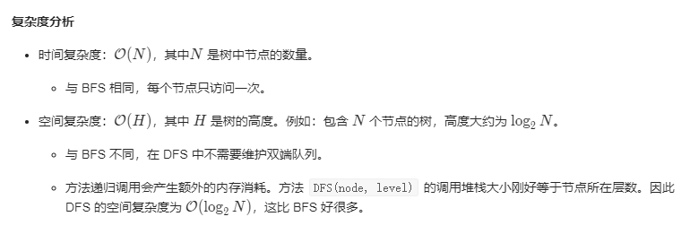
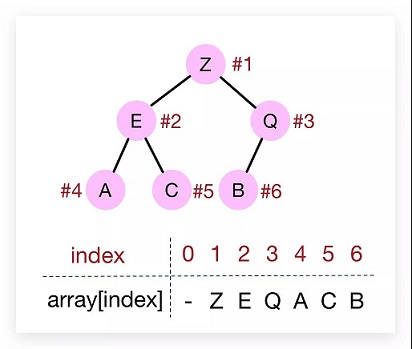
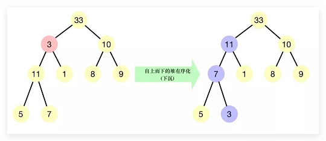
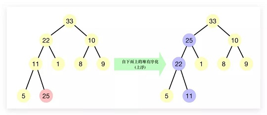
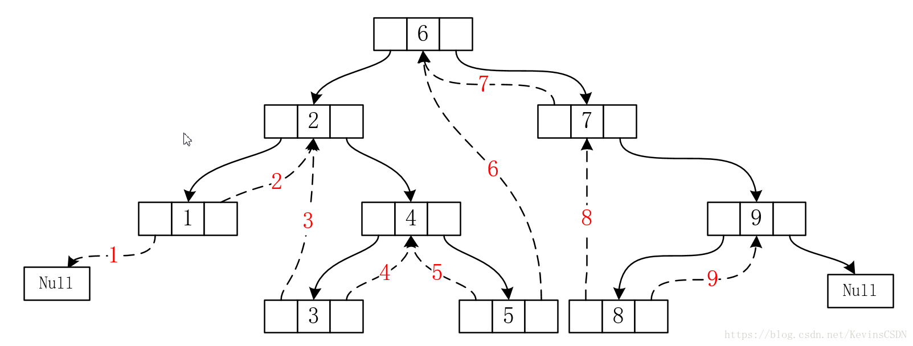

# 二叉树

## ✏ 一、知识点

### 🖋 1、二叉树的存储

* **顺序存储**：这种情况之适合完全二叉树
* **链式存储**：二叉链表和三叉链表（一个parent域），在含有 n 个结点的二叉链表中有（n+1）个空链域。

### 🖋 2、二叉树的创建

> 唯一确定一颗二叉树的方法：中序加前序 或 中序加后序，此时必须假设树中没有重复的元素或者有唯一的结点编号。

#### [**Construct Binary Tree from Preorder and Inorder Traversal**](https://leetcode-cn.com/problems/construct-binary-tree-from-preorder-and-inorder-traversal/)\*\*\*\*

```cpp
TreeNode* buildTree(vector<int>& preorder, vector<int>& inorder) {
    if(inorder.size() <= 0){
        return NULL;
    }
    int tmp = 0;
    for(int i = 0;i < inorder.size();i ++){
        if(preorder[0] == inorder[i]){
            tmp = i;
            break;
        }
    }
    TreeNode *treeNode = new TreeNode(preorder[0]);
    if(tmp > 0){
        // 左闭右开区间
        vector<int> inorder_left(inorder.begin(), inorder.begin() + tmp);
        vector<int> preorder_left(preorder.begin() + 1, preorder.begin() + tmp + 1);
        treeNode->left = buildTree(preorder_left, inorder_left);
    }
    if(inorder.size() > tmp + 1){
        vector<int> inorder_right(inorder.begin() + tmp + 1, inorder.end());
        vector<int> preorder_right(preorder.begin() + tmp + 1, preorder.end());
        treeNode->right = buildTree(preorder_right, inorder_right);
    }
    return treeNode;
}
```

#### \*\*\*\*[**Construct Binary Tree from Inorder and Postorder Traversal**](https://leetcode-cn.com/problems/construct-binary-tree-from-inorder-and-postorder-traversal/)\*\*\*\*

```cpp
TreeNode* buildTree(vector<int>& inorder, vector<int>& postorder) {
    if(inorder.size() == 0){
        return NULL;
    }
    if(inorder.size() == 1){
        return new TreeNode(inorder[0]);
    }
    int tmp = 0;
    for(int i = 0;i < inorder.size();i ++){
        if(postorder.back() == inorder[i]){
            tmp = i;
            break;
        }
    }
    TreeNode *treeNode = new TreeNode(inorder[tmp]);
    if(tmp > 0){
        // 左闭右开区间
        vector<int> inorder_left(inorder.begin(), inorder.begin() + tmp);
        vector<int> postorder_left(postorder.begin(), postorder.begin() + tmp);
        treeNode->left = buildTree(inorder_left, postorder_left);
    }
    if(inorder.size() > tmp + 1){
        vector<int> inorder_right(inorder.begin() + tmp + 1, inorder.end());
        vector<int> postorder_right(postorder.begin() + tmp, postorder.end() - 1);
        treeNode->right = buildTree(inorder_right, postorder_right);
    }
    return treeNode;
}
```

### 🖋 3、二叉树的遍历

> 树的遍历分为**深度优先遍历（DFS）和广度优先遍历（BFS），**深度优先遍历包括前序、中序和后序，广度优先遍历主要是指层次遍历。
>
> **前序遍历**：**先访问根节点**，再前序遍历左子树，再前序遍历右子树 **中序遍历**：先中序遍历左子树，**再访问根节点**，再中序遍历右子树 **后序遍历**：先后序遍历左子树，再后序遍历右子树，**再访问根节点**
>
> * 以根访问顺序决定是什么遍历
> * 左子树都是优先右子树
>
> 由于二叉树的定义本身就是递归的，因此关于二叉树的很多问题都可以用递归的方法的解决。中序、前序和后序遍历用递归的方法很容易解决，这里主要采用迭代的实现方式。

#### \*\*\*\*[**前序遍历：递归实现**](https://leetcode-cn.com/problems/binary-tree-preorder-traversal/)\*\*\*\*

```cpp
vector<int> preorderTraversal(TreeNode* root) {
    vector<int> result;
    if(!root)
        return result;
    result.push_back(root->val);
    if(root->left){
        vector<int> result_left = preorderTraversal(root->left);
        result.insert(result.end(), result_left.begin(), result_left.end());
    } 
    if(root->right){
        vector<int> result_right = preorderTraversal(root->right);
        result.insert(result.end(), result_right.begin(), result_right.end());
    } 
    return result;
}   
```

#### [前序遍历](https://leetcode-cn.com/problems/binary-tree-preorder-traversal/)

> 借助一个栈（栈几乎是递归算法转迭代算法必须的一个踏板），首先要明确地是树中的任何一个结点都要经过一次入栈和出栈的过程。对于二叉树中的**任何一个子树**来说（本身可以看成一个子树），其访问顺序是左子链，然后沿着左子链的反向（即出栈的方向）访问它们的右子树，这里要强调的是右子树不是右结点，因为右子树等同于“**任何一个子树**”。

```cpp
vector<int> preorderTraversal(TreeNode* root) {
    vector<int> preorder;
    stack<TreeNode *> istack;
    TreeNode *ptr = root;
    while(ptr){
        preorder.push_back(ptr->val);
        istack.push(ptr);
        ptr = ptr->left;
    }
    while(!istack.empty()){
        TreeNode *curr_ptr = istack.top();
        istack.pop();
        ptr = curr_ptr->right;
        while(ptr){
            preorder.push_back(ptr->val);
            istack.push(ptr);
            ptr = ptr->left;
        }
    }
    return preorder;
}
```

#### [中序遍历](https://leetcode-cn.com/problems/binary-tree-inorder-traversal/)

> 中序遍历和前序遍历唯一的区别就是：针对树中的任何一个结点，前序是在压栈前访问，而中序是在压栈后访问。

培养算法框架思维：所谓的前序遍历和后序遍历，只是两个很有用的时间点，**前序遍历的代码在进入某一个节点之前的那个时间点执行，后序遍历代码在离开某个节点之后的那个时间点执行**。

```cpp
vector<int> inorderTraversal(TreeNode* root) {
    vector<int> inorder;
    stack<TreeNode *> istack;
    TreeNode *ptr = root;
    while(ptr){
        istack.push(ptr);
        ptr = ptr->left;
    }
    while(!istack.empty()){
        TreeNode *curr_ptr = istack.top();
        inorder.push_back(curr_ptr->val);
        istack.pop();
        ptr = curr_ptr->right;
        while(ptr){
            istack.push(ptr);
            ptr = ptr->left;
        }
    }
    return inorder;
}
```

#### [后序遍历](https://leetcode-cn.com/problems/binary-tree-postorder-traversal/)

> 后序遍历在决定是否可以输出当前节点的值的时候，需要考虑其左右子树是否都已经遍历完成。这里采用的方法是**三次入栈出栈**的方法，即一个节点能不能被访问，取决于它的左右子树都已经入栈出栈完毕并被访问。还有一种**设置游标**的方法，是**一次入栈出栈**的过程。相对而言第二种方法更高效，除了压栈出栈的次数成倍减少外，还会减少对很多**左子树为空的结点的左子树**的判断。



```cpp
vector<int> postorderTraversal(TreeNode* root) {
    vector<int> postorder;
    if(!root)
        return postorder;
    stack<pair<TreeNode *, int>> istack;
    pair<TreeNode*, int> tmpPair(root, 0);
    istack.push(tmpPair);
    while(!istack.empty()){
        tmpPair = istack.top();
        istack.pop();
        if(tmpPair.second == 0){
            istack.push(std::make_pair(tmpPair.first, 1));
            if(tmpPair.first->left){
                istack.push(std::make_pair(tmpPair.first->left, 0));
            }
        }else if(tmpPair.second == 1){
            istack.push(std::make_pair(tmpPair.first, 2));
            if(tmpPair.first->right){
                istack.push(std::make_pair(tmpPair.first->right, 0));
            }
        }else{
            postorder.push_back(tmpPair.first->val);
        }
    }
    return postorder;
}
```



```cpp
vector<int> postorderTraversal(TreeNode* root) {
    vector<int> postorder;
    if(!root)
        return postorder;
    stack<TreeNode *> istack;
    TreeNode *ptr = root;
    TreeNode *lastVisit = root;
    while(ptr || !istack.empty()){
        while(ptr){
            istack.push(ptr);
            ptr = ptr->left;
        }
        ptr = istack.top();
        if(ptr->right == NULL || ptr->right == lastVisit){
            postorder.push_back(ptr->val);
            istack.pop();
            lastVisit = ptr;
            ptr = NULL;
        }else{
            ptr = ptr->right;
        }
    }
    return postorder;
}
```



#### [层次遍历](https://leetcode-cn.com/problems/binary-tree-level-order-traversal/)

> 有三种思路：
>
> * 用一个变量，记录当前层的元素个数，以便换层。
> * 每个元素入队的时候加一个层数的标记。
> * 先将根节点放入队列 queue 中，随后对于 queue 中的每一个节点，我们将它的子节点放入临时队列 temp 中。在 queue 中的所有节点都处理完毕后，temp 中即存放了所有在 queue 对应的层数的下一层中的节点。最后我们将 temp 赋值给 queue，继续进行下一轮的广度优先搜索，直到某一轮 temp 为空。
>
> 思路：用一个队列记录一层的元素，然后扫描这一层元素添加下一层元素到队列（一个数进去出来一次，所以复杂度 $$O(logN)$$ ）



```cpp
vector<vector<int>> levelOrder(TreeNode* root) {
    vector<vector<int>> result;
    if(!root)
        return result;
    int height = 0;
    queue<pair<TreeNode *,int>> iqueue;
    iqueue.push(make_pair(root, 0));
    pair<TreeNode*, int> tmpPair;
    vector<int> level_val;
    while(!iqueue.empty()) {
        tmpPair = iqueue.front();
        int tmp = tmpPair.second;
        if(tmp > height){
            result.push_back(level_val);
            level_val.clear();
            height = tmp;
        }
        level_val.push_back(tmpPair.first->val);
        if(tmpPair.first->left)
            iqueue.push(std::make_pair(tmpPair.first->left, tmp + 1));
        if(tmpPair.first->right)
            iqueue.push(std::make_pair(tmpPair.first->right, tmp + 1));
        iqueue.pop();
    }
    result.push_back(level_val);
    return result;
}
```



```cpp
vector<vector<int>> levelOrder(TreeNode* root) {
    vector<vector<int>> result;
    if(!root)
        return result;
    int len = 1;
    queue<TreeNode *> iqueue;
    iqueue.push(root);
    TreeNode* ptr = root;
    vector<int> level_val;
    while(!iqueue.empty()){
        int tmp_len = 0;
        while(len > 0){
            ptr = iqueue.front();
            level_val.push_back(ptr->val);
            if(ptr->left){
                iqueue.push(ptr->left);
                tmp_len++;
            }
            if(ptr->right){
                iqueue.push(ptr->right);
                tmp_len++;
            }
            iqueue.pop();
            len--;
        }
        len = tmp_len;
        result.push_back(level_val);
        level_val.clear();
    }
    return result;
}
```



## ✏ 二、应用

### 🖋 1、BFS 层次应用

#### [binary-tree-level-order-traversal-ii](https://leetcode-cn.com/problems/binary-tree-level-order-traversal-ii/)

给定一个二叉树，返回其节点值自底向上的层次遍历。 （即按从叶子节点所在层到根节点所在的层，逐层从左向右遍历）

```cpp
// 1、头插
result.insert(result.begin(), level_val);
// 2、尾插加最后反转
reverse(res.begin(),res.end());
// 3、使用栈中转
vector<vector<int>> levelOrderBottom(TreeNode* root) {
    vector<vector<int>> result;
    if(!root)
        return result;
    int len = 1;
    queue<TreeNode *> iqueue;
    stack<vector<int>> istack;
    iqueue.push(root);
    TreeNode* ptr = root;
    vector<int> level_val;
    while(!iqueue.empty()){
        int tmp_len = 0;
        while(len > 0){
            ptr = iqueue.front();
            level_val.push_back(ptr->val);
            if(ptr->left){
                iqueue.push(ptr->left);
                tmp_len++;
            }
            if(ptr->right){
                iqueue.push(ptr->right);
                tmp_len++;
            }
            iqueue.pop();
            len--;
        }
        len = tmp_len;
        istack.push(level_val);
        level_val.clear();
    }
    while(!istack.empty()){
        result.push_back(istack.top());
        istack.pop();
    }
    return result;
}
```

#### [binary-tree-zigzag-level-order-traversal](https://leetcode-cn.com/problems/binary-tree-zigzag-level-order-traversal/)

给定一个二叉树，返回其节点值的锯齿形层次遍历。（即先从左往右，再从右往左进行下一层遍历，以此类推，层与层之间交替进行）。

> 方法一：BFS（广度优先遍历） 
>
> 最直观的方法是 BFS，逐层遍历树。BFS 在每层的默认顺序是从左到右，因此需要调整 BFS 算法以生成锯齿序列。最关键的是使用**双端队列遍历**，可以在队列的任一端插入元素。

> 如果需要 FIFO （先进先出）的顺序，则将新元素添加到队列尾部，后插入的元素就可以排在后面。如果需要 FILO （先进后出）的顺序，则将新元素添加到队列首部，后插入的元素就可以排在前面。
>
> 实现方式：
>
> * 使用两层嵌套循环。外层循环迭代树的层级，内层循环迭代每层上的节点。（**实现**）
> * 也可以使用一层循环实现 BFS。将要访问的节点添加到队列中，使用 分隔符（例如：空节点）把不同层的节点分隔开。分隔符表示一层结束和新一层开始。
>
>  注意：一种替代做法是，实现标准的 BFS 算法，得到每层节点从左到右的遍历顺序。然后按照要求 **翻转** 某些层节点的顺序，得到锯齿形的遍历结果。


> 方法二：DFS （深度优先遍历） 
>
> 也可以使用 DFS 实现 BFS 的遍历顺序。在 DFS 遍历期间，将结果保存在按层数索引的全局数组中。即元素 array\[level\] 存储同一层的所有节点。然后在 DFS 的每一步更新全局数组。与改进的 BFS 算法类似，使用双端队列保存同一层的所有节点，并交替插入方向（从首部插入或从尾部插入）得到需要的输出顺序。

> 使用递归实现 DFS 算法。定义一个递归方法 DFS\(node, level\)，方法参数为当前节点 node 和指定层数 level。该方法共执行三个步骤：
>
> 1. 如果是第一次访问该层的节点，即该层的双端队列不存在。那么创建一个双端队列，并添加该节点到队列中。
> 2. 如果当前层的双端队列已存在，根据顺序，将当前节点插入队列头部或尾部。
> 3. 最后，为每个节点调用该递归方法。



```cpp
vector<vector<int>> zigzagLevelOrder(TreeNode* root) {
    std::vector<std::vector<int>> result;
    if(!root)
        return result;
    int len = 1;
    bool flag = true;
    std::deque<TreeNode *> ideque;
    ideque.push_back(root);
    TreeNode* ptr = root;
    std::vector<int> level_val;
    while(!ideque.empty()){
        int tmp_len = 0;
        while(len > 0){
            if(flag){
                ptr = ideque.back();
                ideque.pop_back();
                if(ptr->left){
                    ideque.push_front(ptr->left);
                    tmp_len++;
                }
                if(ptr->right) {
                    ideque.push_front(ptr->right);
                    tmp_len++;
                }
            }else{
                ptr = ideque.front();
                ideque.pop_front();
                if(ptr->right) {
                    ideque.push_back(ptr->right);
                    tmp_len++;
                }
                if(ptr->left){
                    ideque.push_back(ptr->left);
                    tmp_len++;
                }
            }
            level_val.push_back(ptr->val);
            len--;
        }
        len = tmp_len;
        flag = !flag;
        result.push_back(level_val);
        level_val.clear();
    }
    return result;
}
```

### 🖋 2、常见示例

#### [maximum-depth-of-binary-tree](https://leetcode-cn.com/problems/maximum-depth-of-binary-tree/)

给定一个二叉树，找出其最大深度。二叉树的深度为根节点到最远叶子节点的最长路径上的节点数。

```cpp
// 1、递归
max(maxDepthRecursion(root->left), maxDepthRecursion(root->right)) + 1;
// 2、BFS
// 层次遍历代码第56换成高度加1
// 3、DFS
int maxDepth(TreeNode* root) {
    if(!root)
        return 0;
    int height = 0;
    stack<pair<TreeNode *, int>> istack;
    TreeNode *ptr = root;
    pair<TreeNode *, int> tmpPair;
    int tmpHeight = 1;
    while(ptr){
        istack.push(std::make_pair(ptr, tmpHeight));
        ptr = ptr->left;
        tmpHeight++;
    }
    while(!istack.empty()){
        tmpPair = istack.top();
        if(!tmpPair.first->left && !tmpPair.first->right){
            height = height < tmpPair.second ? tmpPair.second : height;
        }
        tmpHeight = istack.top().second + 1;
        istack.pop();
        ptr = tmpPair.first->right;
        while(ptr){
            istack.push(std::make_pair(ptr, tmpHeight));
            ptr = ptr->left;
            tmpHeight++;
        }
    }
    return height;
}
```

#### \*\*\*\*[**average-of-levels-in-binary-tree**](https://leetcode-cn.com/problems/average-of-levels-in-binary-tree/)\*\*\*\*

给定一个非空二叉树，返回一个由每层节点平均值组成的数组。

> 方法一：深度优先搜索。使用两个数组： sum 存放树中每一层的节点数值之和，以及 count 存放树中每一层的节点数量之和。在遍历时，我们需要额外记录当前节点所在的高度，并根据高度 h 更新数组元素 sum\[h\] 和 count\[h\]。在遍历结束之后，res = sum / cnt 即为答案。
>
> 方法二：广度优先搜索。（**实现**）

```cpp
vector<double> averageOfLevels(TreeNode* root) {
    vector<double> result;
    if(!root)
        return result;
    int len = 1;
    queue<TreeNode *> iqueue;
    iqueue.push(root);
    TreeNode* ptr = root;
    double level_sum = root->val;
    while(!iqueue.empty()){
        result.push_back(level_sum / len);
        level_sum = 0;
        int tmp_len = 0;
        while(len > 0){
            ptr = iqueue.front();
            if(ptr->left){
                iqueue.push(ptr->left);
                level_sum += ptr->left->val;
                tmp_len++;
            }
            if(ptr->right){
                iqueue.push(ptr->right);
                level_sum += ptr->right->val;
                tmp_len++;
            }
            iqueue.pop();
            len--;
        }
        len = tmp_len;
    }
    return result;
}
```

### 🖋 3、堆

堆 Heap, 一种特殊的树状数据结构。在堆中，对于任意节点都有其值恒大于等于或小于等于其子节点的值，前者称之为max heap最大堆，后者则称之为min heap最小堆。常见的堆有:二叉堆、多叉堆、斐波那契堆等。这里我们所使用的即是二叉堆，其在形式上是一个完全二叉树。

一般地，我们通过数组来实现二叉堆，将堆中元素按从上到下、从左到右的层级顺序依次存储到数组中即可\(一般地为简便起见，通常从数组的第二个位置开始存储元素，不使用数组索引为0的位置。故大小为N的堆，所需数组的空间大小为N+1\)。



 在一个堆中，对于位置为**k**节点，根据上图可知，其父节点在数组中的位置索引为 floor\(k/2\)，其两个子节点在数组中的位置索引分别为**`2*k`、`2*k+1`。**

#### **堆有序化**

一个堆可能会由于某种原因打破其本来的有序状态，此时就需要重新调整来恢复、保证堆的有序状态，这个调整恢复的过程就称之为堆的有序化。

> 堆有序:当一颗二叉树的任意节点恒大于等于或小于等于其两个子节点时，即被称为堆有序

本文我们以最大堆为例进行介绍，最小堆与其大同小异，此处将不再赘述。具体地，当一个堆的根节点元素被较小的元素替换时，我们就需要自上而下地恢复堆的有序化；当向堆底插入一个新节点时，我们则需要自下而上地恢复堆的有序化**。**

**1. 自上而下的堆有序化\(下沉\)**

当一个最大堆的有序状态因为某个节点比其\(两个或其中一个\)子节点更小而被打破时，那么可以通过将该节点与其两个子节点中的较大者交换来恢复堆，该过程形象化地被称为"下沉"。交换后，可能会导致其在子节点处依然会继续打破堆的有序化，故我们需要不断地使用相同的方式将其进行修复，将节点向下移动直到其子节点均比其更小或到达了堆的底部。下图即是一个值为3的节点通过"下沉"恢复堆的有序化的过程**。**



**2. 自下而上的堆有序化\(上浮\)**

当一个最大堆的有序状态因为某个节点比其父节点更大而被打破时，那么可以通过将该节点与其父节点交换来恢复堆，该过程形象化地被称为"上浮"。交换后，可能会导致其在父节点处依然会继续打破堆的有序化，故我们需要不断地使用相同的方式将其进行修复，将节点向上移动直到其父节点节点比其更大或成为了堆的根节点。下图即是一个值为25的节点通过"上浮"恢复堆的有序化的过程。



## ✏ 三、线索二叉树

### 🖋 1、定义

> 现有一棵结点数目为n的二叉树，采用二叉链表的形式存储。对于每个结点均有指向左右孩子的两个指针域，而结点为 n 的二叉树一共有 n-1 条有效分支路径，则二叉链表中存在 $$2n-(n-1)=n+1$$ 个空指针域，这些空指针造成了空间浪费。因此将某结点的空指针域指向该结点的前驱后继，定义规则如下：

> > 若结点的左子树为空，则该结点的左孩子指针指向其前驱结点。  
> > 若结点的右子树为空，则该结点的右孩子指针指向其后继结点。
>
> 这种指向前驱和后继的指针称为线索。将一棵普通二叉树以某种次序遍历，并添加线索的过程称为线索化。为了区分一个结点的lchild指针是指向左孩子还是前驱结点，需要添加标志位ltag，rtag。并定义规则如下：

> > ltag为0时，指向左孩子，为1时指向前驱  
> > rtag为0时，指向右孩子，为1时指向后继
>
> 添加ltag和rtag属性后的结点结构如下：


### 🖋 2、结构



### 🖋 3、创建

### 🖋 4、遍历

