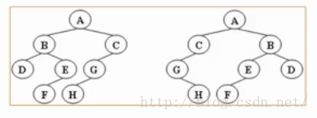

# 死磕二叉树

## ✏ 1、`DFS`深度遍历 & 递归

###  ****[**Binary Tree Maximum Path Sum**](https://leetcode-cn.com/problems/binary-tree-maximum-path-sum/)\*\*\*\*

给定一个**非空**二叉树，返回其最大路径和。本题中，路径被定义为一条从树中任意节点出发，达到任意节点的序列。该路径**至少包含一个**节点，且不一定经过根节点。

> 路径每到一个节点，有 3 种选择： 停下不走。 走到左子节点。 走到右子节点。走到子节点，又面临这 3 种选择。于是有了递归的思路。 不能走进一个分支，又掉头走另一个分支，不符合要求。
>
> 定义递归函数 
>
> 我们关心：如果路径走入一个子树，能从中捞取的最大收益，不关心具体怎么走。 这是一种属于递归的、自顶而下的思考方式。 
>
> 定义 `dfs` 函数：返回当前子树能向父节点 “提供” 的最大路径和。
>
> 向下：即，一条从父节点延伸下来的路径，能在当前子树中获得的最大收益。它分为三种情况，取其中最大的： 停在当前子树的 root，收益：root.val。 走入左子树，最大收益：`root.val + dfs(root.left)`。 走入右子树，最大收益：`root.val + dfs(root.right)`。 当遍历到 null 节点时，收益为 0，所以返回 0。
>
> 向上：如果一个子树提供的「最大路径和」为负，如下图。路径走入它，收益不增反减，我们希望这个子树完全不被考虑，所以让它返回 0，成为死支。

```cpp
int helper(TreeNode *node, int &sum){
    if(!node){
        sum = max(sum, 0);
        return 0;
    }
    int lsum = 0, rsum = 0;
    if(node->left){
        lsum = max(0, helper(node->left, sum));  // 左子树的贡献
    }
    if(node->right){
        rsum = max(0, helper(node->right, sum)); // 右子树的贡献
    }
    sum = max(sum, node->val + lsum + rsum); // 当前子树的 maxSum 挑战最大值
    return node->val + max(lsum, rsum);      // 向父节点提供的最大和，要包括自己
}
int maxPathSum(TreeNode* root){
    int maxSum = INT_MIN;
    helper(root, maxSum);
    return maxSum;
}
```

### [**Path Sum**](https://leetcode-cn.com/problems/path-sum/)\*\*\*\*

给定一个二叉树和一个目标和，判断该树中是否存在根节点到叶子节点的路径，这条路径上所有节点值相加等于目标和。**（分治）**

```cpp
bool hasPathSum(TreeNode* root, int sum){
    if(!root)
        return false;
    if(root && !root->left && !root->right)
        return sum == root->val;
    return hasPathSum(root->left, sum - root->val)
        || hasPathSum(root->right, sum - root->val);
}
```

### \*\*\*\*[**Path Sum II**](https://leetcode-cn.com/problems/path-sum-ii/)\*\*\*\*

给定一个二叉树和一个目标和，找到所有从根节点到叶子节点路径总和等于给定目标和的路径。**（回溯）**

> 思路一：迭代，后续遍历，PATH数组和栈同步，到叶节点判断当前路径是否满足，满足就将PATH加到结果中。
>
> 思路二：递归，

## ✏ **2、`LCA`问题**

#### [lowest-common-ancestor-of-a-binary-tree](https://leetcode-cn.com/problems/lowest-common-ancestor-of-a-binary-tree/)

给定一个二叉树, 找到该树中两个指定节点的最近公共祖先。经典的`LCA（Least Common Ancestors）`问题。

> 思路一、后序遍历：**因为后序遍历的栈中始终存放着当前要访问节点的祖先节点**。所以两次后序遍历，分别遍历到两个节点位置结束，然后两个栈分别保存两个节点的祖先节点，依次弹栈，遇到第一个相同的节点即可。（最应该想到的解法）
>
> 思路二、递归：
>
> 思路三、倍增法：
>
> 思路四、欧拉序+ST表：
>
> 思路五、**`Tarjan` 算法：**

> 思路一、后序遍历：**因为后序遍历的栈中始终存放着当前要访问节点的祖先节点**。所以两次后序遍历，分别遍历到两个节点位置结束，然后两个栈分别保存两个节点的祖先节点，依次弹栈，遇到第一个相同的节点即可。（最应该想到的解法）
>
> 思路二、递归：
>
> 思路三、倍增法：
>
> 思路四、欧拉序+ST表：
>
> 思路五、**`Tarjan` 算法：**



```cpp
void getAncestors(TreeNode *root, TreeNode* node, vector<TreeNode *> &astack){
    const TreeNode *cur;
    TreeNode *ptr = root;
    const TreeNode *last = NULL;
    while(ptr != NULL || !astack.empty()){
        while(ptr != NULL){
            astack.push_back(ptr);
            if(ptr == node){
                return;
            }
            ptr = ptr->left;
        }
        cur = astack.back();
        if(cur->right == NULL || cur->right == last){
            astack.pop_back();
            last = cur;
        }else{
            ptr = cur->right;
        }
    }
}
TreeNode* lowestCommonAncestor(TreeNode* root, TreeNode* p, TreeNode* q) {
    vector<TreeNode *> astack1, astack2;
    getAncestors(root, p, astack1);
    getAncestors(root, q, astack2);
    for(int i = astack1.size() - 1; i >= 0; --i){
        for(int j = astack2.size() - 1; j >= 0; --j){
            if(astack1[i] == astack2[j]){
                return astack1[i];
            }
        }
    }
    return root;
}
```



```

```



拓展：

## ✏ 3、[序列化和反序列化](https://leetcode-cn.com/problems/serialize-and-deserialize-binary-tree/)

> 思路一：BFS 序列成对应的完全二叉树（超时，主要是字符串`split`耗时长）。
>
> 思路二：DFS 前中后序都可以，递归实现。
>
> 思路三：改进的BFS，不是完全二叉树，而是扩展二叉树的叶子节点为NULL节点。
>
> 思路四：类似于[官方题解方法二](https://leetcode-cn.com/problems/serialize-and-deserialize-binary-tree/solution/er-cha-shu-de-xu-lie-hua-yu-fan-xu-lie-hua-by-le-2/)，用分隔符包装。



```cpp
// Encodes a tree to a single string.
string serialize(TreeNode* root) {
    string result;
    if(!root)
        return "[]";
    queue<TreeNode *> pqueue;
    pqueue.push(root);
    while(true){
        bool sign = true;
        int len = pqueue.size();
        for(int i = 0; i < len; i++) {
            TreeNode *ptr = pqueue.front();
            pqueue.pop();
            if (ptr) {
                result.append(to_string(ptr->val));
                result.push_back(',');
                if (ptr->left) {
                    pqueue.push(ptr->left);
                    sign = false;
                } else {
                    pqueue.push(NULL);
                }
                if (ptr->right) {
                    pqueue.push(ptr->right);
                    sign = false;
                } else {
                    pqueue.push(NULL);
                }
            } else {
                result.append("X,");
                pqueue.push(NULL);
                pqueue.push(NULL);
            }
        }
        if(sign)
            break;
    }
    while(!result.empty() && (result.back() == ',' || result.back() == 'X'))
        result.pop_back();
    return "[" + result + "]";
}

// Decodes your encoded data to tree.
TreeNode* deserialize(string data) {
    if(data.size() <= 2)
        return NULL;
    vector<string> tokens;
    string str;
    for(int i = 1; i < data.size() - 1; ++i){
        if(data[i] == 'X'){
            tokens.push_back("X");
            i++;
        }else if(data[i] == ','){
            tokens.push_back(str);
            str.clear();
        }else{
            str.push_back(data[i]);
        }
    }
    tokens.push_back(str);
    int len = tokens.size();
    if(tokens.empty())
        return NULL;
    queue<pair<TreeNode *, int> > iqueue;
    TreeNode *root = new TreeNode(stoi(tokens[0]));
    iqueue.push(make_pair(root, 0));
    while(!iqueue.empty()){
        auto ptr = iqueue.front();
        iqueue.pop();
        int idx = 2 * ptr.second;
        if(idx + 1 < len && tokens[idx + 1] != "X"){
            ptr.first->left = new TreeNode(stoi(tokens[idx + 1]));
            if(2 * (idx + 1) + 1 < len)
                iqueue.push(make_pair(ptr.first->left, idx + 1));
        }
        if(idx + 2 < len && tokens[idx + 2] != "X"){
            ptr.first->right = new TreeNode(stoi(tokens[idx + 2]));
            if(2 * (idx + 2) + 1 < len)
                iqueue.push(make_pair(ptr.first->right, idx + 2));
        }
    }
    return root;
}
```



## ✏ 4、二叉树遍历之Morris算法


## ✏ 5、镜像问题

### 5.1、[**二叉树的镜像**](https://leetcode-cn.com/problems/er-cha-shu-de-jing-xiang-lcof/)\*\*\*\*

### 5.2、[判断二叉树是不是对称二叉树](https://leetcode-cn.com/problems/dui-cheng-de-er-cha-shu-lcof/)

### 5.3、求X节点的个数（阿里面试题）

### 5.4、判断两棵二叉树是否同构

同构是指：两课树可以通过有限次变换左右子树变为同一棵树。如图：



```cpp
bool Isomorphic(TreeNode* t1, TreeNode* t2){
    if(t1 == NULL && t2 == NULL)
        return true;
    if((t1 == NULL) && (t2 != NULL) || ((t1 != NULL) && (t2 == NULL)))
        return false;
    if(t1->val != t2->val)
        return false;
    if((t1->left == NULL) && (t2->left == NULL))
        return Isomorphic(t1->right, t2->right);
    if(((t1->left != NULL) && (t2->left != NULL))
        &&(t1->left->val == t2->left->val))
        //如果两个都不为空且左儿子相等，应该递归的找左对应左，右对应右
        return Isomorphic(t1->left, t2->left) && Isomorphic(t1->right, t2->right);
    else
        //否则就是交换了，递归的判断左对应右，右对应左
        return Isomorphic(t1->left, t2->right) && Isomorphic(t1->right, t2->left);
}
```

## ✏ 6、其他

### 6.1、逆时针打印完全二叉树的边界节点

完全二叉树用数组存储，从根节点开始逆时针打印完全二叉树的边界节点。

```cpp
vector<int> BinaryTree::getSeq(int n, vector<int>& tree){
    vector<int> ans;
    if(n == 1){
        ans.push_back(tree[0]);
        return ans;
    }
    // 左边界
    int i = 1;
    while(i - 1 < n){
        ans.push_back(tree[i - 1]);
        i *= 2;
    }
    ans.pop_back();
    // 叶节点
    int j = i / 2 - 2;
    i = i / 2 / 2 - 1;
    for(int k = i; k >= 0 && k < n && k <= j; ++k){
        if(k * 2 + 1 < n)
            ans.push_back(tree[k * 2 + 1]);
        if(k * 2 + 2 < n)
            ans.push_back(tree[k * 2 + 2]);
        if(k * 2 + 1 >= n)
            ans.push_back(tree[k]);
    }
    // 右边界
    while(j > 0){
        ans.push_back(tree[j]);
        j = (j - 2) / 2;
    }
    return ans;
}
```

### 6.2、[**Binary Tree Cameras**](https://leetcode-cn.com/problems/binary-tree-cameras/)\*\*\*\*

