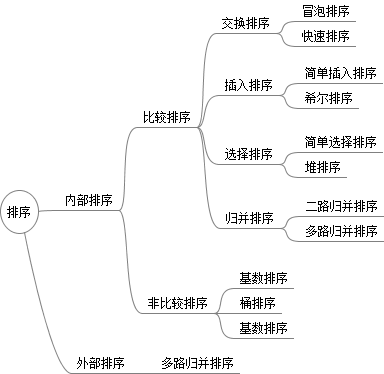
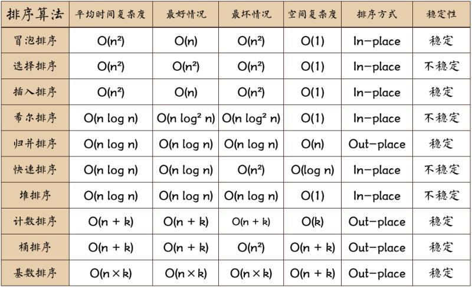

# 排序算法

### 排序算法

#### 1、分类

排序可分为内部排序和外部排序，常用的十种内部排序算法又可以分为两大类：

* **比较类排序**：通过比较来决定元素间的相对次序，由于其时间复杂度不能突破O\(nlogn\)，因此也称为非线性时间比较类排序。
* **非比较类排序**：不通过比较来决定元素间的相对次序，它可以突破基于比较排序的时间下界，以线性时间运行，因此也称为线性时间非比较类排序。

#### 2、算法比较

* **稳定**：如果a原本在b前面，而a=b，排序之后a仍然在b的前面。
* **不稳定**：如果a原本在b的前面，而a=b，排序之后 a 可能会出现在 b 的后面。
* **时间复杂度**：对排序数据的总的操作次数。反映当n变化时，操作次数呈现什么规律。
* **空间复杂度：**是指算法在计算机内执行时所需存储空间的度量，它也是数据规模n的函数。

